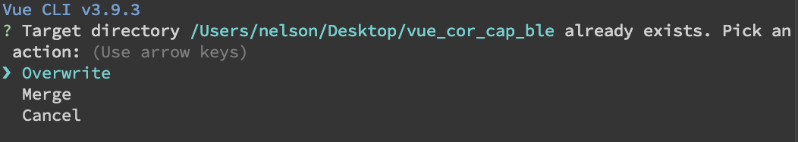

### 一個採用 Vue.js 、 Cordova 及 Capacitor 套件而成的 Hybrid App
---
#### 前置作業：Vue與Cordova專案融合
一、 創建及合併專案
```bash
# 若沒有Cordova指令，需安裝全域Cordova
$ npm install -g cordova

# !!!一定要先創建Cordova的專案，才可以創建Vue專案
# 創建Cordova 專案
$ cordova create [專案名]

# 創建Vue專案，專案名需與Cordova的一樣
$ vue create [專案名]
```
此時，會出現這個畫面  
  
請選擇 *Merge* ，讓兩個專案合併  

二、 設定環境
- 新增Vue設定檔
```bash
$ cd [專案名]
$ touch vue.config.js # 創建Vue的設定檔
```   

- 在vue.config.js 輸入以下
```js
module.exports = {
    //基本路徑
	publicPath: './',
	//輸出文件目錄
    outputDir: 'www',
    productionSourceMap:false, //不生成map
}
```

- 安裝Cordova Plugin環境
```bash
$ npm install vue-cordova
```

- main.js中加入  
```js
import VueCordova from 'vue-cordova'
Vue.use(VueCordova)

// add cordova.js only if serving the app through file://
if (window.location.protocol === 'file:' || window.location.port === '3000') {
  var cordovaScript = document.createElement('script')
  cordovaScript.setAttribute('type', 'text/javascript')
  cordovaScript.setAttribute('src', 'cordova.js')
  document.body.appendChild(cordovaScript)
}

```

- .gitignore加入這三個資料夾名稱
```
ios
android
www
```

#### Cordova Plugins 安裝
- 執行指令：```$ cordova plugin add cordova-plugin-device```
- 此專案使用到的plugins
    - [cordova-plugin-ble-central](https://github.com/don/cordova-plugin-ble-central)

---
### 使用 Cordova 指令輸出
#### 各App平台輸出專案位置
1) iOS：[platforms/ios](platforms/ios)
2) Android：[platforms/android](platforms/android)

#### Vue輸出app專案
- 若platforms下無此專案，請執行：  
1) iOS： ```$ cordova platform add ios```  
2) Android：```$ cordova platform add android```

- 若platforms下已有此專案，且Vue專案已做更改，需重新輸出App，請執行：
1) iOS： 
```bash
$ npm run build
$ cordova build ios

# 此專案也寫好了Script，可直接執行
$ npm run cor_ios
```

2) Android：
```bash
$ npm run build
$ cordova build android

# 此專案也寫好了Script，可直接執行
$ npm run cor_android
```
---
### 使用 Capacitor 指令輸出
#### 安裝 Capacitor
```bash
$ npm install --save @capacitor/core @capacitor/cli
```

#### 初始化Cap
```bash
$ npx cap init
```

#### Capacitor輸出設定檔
- capacitor.config.json

#### 各App平台輸出專案位置
1) iOS：[ios](./ios)
2) Android：[android](./android)

#### Vue輸出app專案
- 若無app專案，請先執行：  
1) iOS： ```$ npx cap add ios```  
2) Android：```$ npx cap add android```  

- 若已有app專案，且Vue專案已做更改，需重新輸出App，請執行：
1) iOS： 
```bash
$ npm run build
$ npx cap copy
$ npx cap open ios

# 此專案也寫好了Script，可直接執行
$ npm run cap_ios
```

2) Android：
```bash
$ npm run build
$ npx cap copy
$ npx cap open android

# 此專案也寫好了Script，可直接執行
$ npm run cap_android
```
---
#### 觀看UI修改，Hot Reload
```bash
$ npm run serve
```
